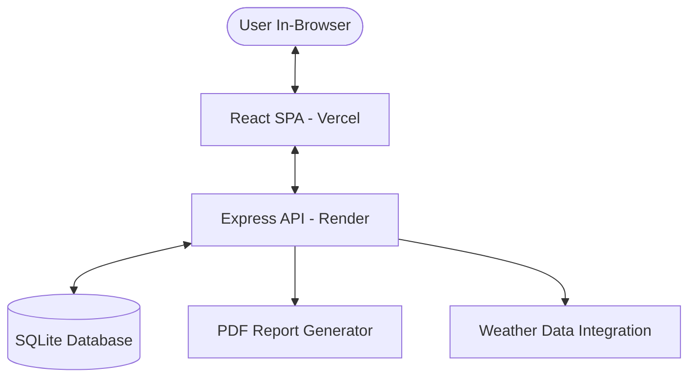

# JalSarathi 💧 — Smart Water Management & Sustainability Suite

JalSarathi is a data-driven ecosystem designed to tackle the growing water crisis in India. It empowers citizens, urban planners, and sustainability advocates with high-precision tools for **Rainwater Harvesting (RWH)** and **Water Quality Assessment**.

🚀 **Live Demo**: [JalSarathi Web App](https://jal-sarathi.vercel.app/)

---

## 🌟 Presentation Summary (For Today)

If you are presenting this project, here is the core value proposition:
- **Vision**: To democratize water conservation data and make sustainable architecture accessible to every household.
- **Innovation**: Bridges the gap between complex hydrological data (rainfall, runoff coefficients, HPI) and user-friendly actionable insights.
- **Impact**: Helps users reduce dependency on groundwater/tankers, saves money, and ensures health safety through heavy metal analysis.

---

## 🛠️ Core Modules & Components

### 1. 🌧️ Rainwater Harvesting (RWH) Engine
The heart of JalSarathi. It calculates the annual harvestable potential of a property using specialized hydrological parameters.
- **Hyper-Local Data**: Uses predefined historical rainfall averages for major Indian cities.
- **Runoff Optimization**: Accounts for different catchment surfaces (Concrete, Tiles, Open Ground) using standard runoff coefficients.
- **Financial Analytics**: Provides a comprehensive ROI analysis including system cost, cumulative savings, and the **Payback Period**.
- **Demand Satisfaction**: Estimates what percentage of a household's annual water requirement can be met solely by harvested rain.

### 2. ⚗️ Water Quality Suite (HPI Analysis)
A scientific approach to water safety, moving beyond simple "potability" checks to complex chemical analysis.
- **Heavy Metal Pollution Index (HPI)**: Implements the HPI formula to calculate contamination levels.
- **Safety Benchmarking**: Compares user-input values for Lead (Pb), Arsenic (As), and Mercury (Hg) against **WHO & BIS (IS 10500:2012)** standards.
- **Visual Risk Assessment**: Dynamic charting shows exactly where parameters exceed safe limits.

### 3. 🏛️ Resource & Policy Hub
- **Vendor Directory**: Connects users with local RWH system installers and water testing labs.
- **Subsidy Mapping**: A guide to state-wise government incentives and policies for water conservation.

---

## 💻 Tech Stack & Architecture

JalSarathi is built as a highly responsive, full-stack monorepo designed for scale and performance.

### **Frontend**
- **React 18 + Vite**: For a blistering fast and modern UI experience.
- **Tailwind CSS**: Custom design system tailored for a premium "eco-friendly" aesthetic.
- **Framer Motion**: Smooth, cinematic page transitions and micro-animations.
- **Recharts**: High-performance charting for RWH and Quality data visualization.
- **Lucide React**: Clean, modern iconography.

### **Backend & Security**
- **Node.js (Express)**: Robust RESTful API architecture.
- **SQLite**: Local, lightweight persistent storage for assessments and logs.
- **Helmet**: Advanced security middleware (configured for CORS and CORP safety).
- **PDFKit**: Server-side engine for generating structured assessment reports.

### **Deployment**
- **Frontend**: Global CDN hosting via **Vercel**.
- **Backend**: Managed API deployment via **Render**.

---

## 🧠 System Architecture



---

## 🏁 Getting Started & Local Setup

### 1. Requirements
Ensure you have **Node.js (v18+)** installed.

### 2. Clone & Install
```bash
git clone https://github.com/acchasujal/JalSarathi.git
cd JalSarathi
```

### 3. Backend Setup
```bash
cd backend
npm install
npm start # Server runs on http://localhost:3001
```

### 4. Frontend Setup
```bash
cd ../frontend
npm install
npm run dev # App runs on http://localhost:5173
```

---

## 🗺️ Roadmap: The Future of JalSarathi
- [ ] **AI-Based Prediction**: Using machine learning to predict water demand based on occupancy and local climate.
- [ ] **IoT Integration**: Real-time sensor data for tank levels and filter health.
- [ ] **Community Sharing**: A platform for neighborhoods to share excess harvested water.
- [ ] **Mobile App**: Native iOS/Android experience using React Native.

---

## 📄 License & Acknowledgments
Distributed under the **MIT License**. 

Special thanks to the **India Meteorological Department (IMD)** and **Central Ground Water Board (CGWB)** for providing the foundational data that makes our calculations possible.

> [!TIP]
> **"Jal Hi Jeevan Hai" (Water is Life)** — Let's build a sustainable future together.
